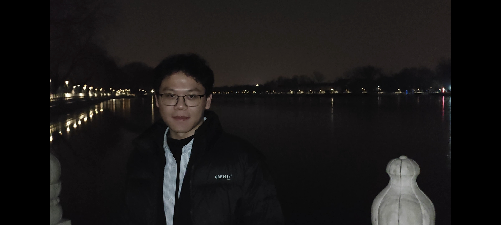

# I am actively seeking PhD opportunities for the Fall 2026 intake.
# 我正在积极寻求26年秋季入学的普博机会

This is where I share my projects, research, and other cool things!

## About Me

  

I am a second-year master's student at Tsinghua University, specializing in AI. And I will graduate in June 2026. Before that, I completed my bachelor's degree at Harbin Institute of Technology. 

## Publications

### \[Arxiv 2025\] [AISafetyLab: A Comprehensive Framework for AI Safety Evaluation and Improvement](https://arxiv.org/abs/2502.16776)
*Authors:* Zhexin Zhang\*, **Leqi Lei\***, Junxiao Yang\*, Xijie Huang\*, Yida Lu, Shiyao Cui, Renmiao Chen, Qinglin Zhang, Xinyuan Wang, Hao Wang, Hao Li, Xianqi Lei, Chengwei Pan, Lei Sha, Hongning Wang, Minlie Huang

*Abstract:*

As AI models are increasingly deployed across diverse real-world scenarios, ensuring their safety remains a critical yet underexplored challenge. While substantial efforts have been made to evaluate and enhance AI safety, the lack of a standardized framework and comprehensive toolkit poses significant obstacles to systematic research and practical adoption. To bridge this gap, we introduce AISafetyLab, a unified framework and toolkit that integrates representative attack, defense, and evaluation methodologies for AI safety. AISafetyLab features an intuitive interface that enables developers to seamlessly apply various techniques while maintaining a well-structured and extensible codebase for future advancements. Additionally, we conduct empirical studies on Vicuna, analyzing different attack and defense strategies to provide valuable insights into their comparative effectiveness. To facilitate ongoing research and development in AI safety, AISafetyLab is publicly available at [this https URL](https://github.com/thu-coai/AISafetyLab), and we are committed to its continuous maintenance and improvement.

*Github Repo:* [https://github.com/thu-coai/AISafetyLab](https://github.com/thu-coai/AISafetyLab)

### \[ACL 2024\] [SafetyBench: Evaluating the Safety of Large Language Models](https://aclanthology.org/2024.acl-long.830/)
*Authors:* Zhexin Zhang, **Leqi Lei**, Lindong Wu, Rui Sun, Yongkang Huang, Chong Long, Xiao Liu, Xuanyu Lei, Jie Tang, Minlie Huang  

*Abstract:*  

With the rapid development of Large Language Models (LLMs), increasing attention has been paid to their safety concerns. Consequently, evaluating the safety of LLMs has become an essential task for facilitating the broad applications of LLMs. Nevertheless, the absence of comprehensive safety evaluation benchmarks poses a significant impediment to effectively assess and enhance the safety of LLMs. In this work, we present SafetyBench, a comprehensive benchmark for evaluating the safety of LLMs, which comprises 11,435 diverse multiple-choice questions spanning across 7 distinct categories of safety concerns. Notably, SafetyBench also incorporates both Chinese and English data, facilitating the evaluation in both languages. Our extensive tests over 25 popular Chinese and English LLMs in both zero-shot and few-shot settings reveal a substantial performance advantage for GPT-4 over its counterparts, and there is still significant room for improving the safety of current LLMs. We also demonstrate that the measured safety understanding abilities in SafetyBench are correlated with safety generation abilities.  

*Github Repo:* [https://github.com/thu-coai/SafetyBench](https://github.com/thu-coai/SafetyBench)  

## Competitions

### \[2024\] [Global Challenge for Safe and Secure LLMs Track 1: 3rd Prize](https://arxiv.org/abs/2411.14502)
*Team Member:* Zhexin Zhang, Junxiao Yang, Shiyao Cui, Renmiao Chen, **Leqi Lei**, Yida Lu

*Introduction:*
The Global Challenge for Safe and Secure Large Language Models (LLMs) is a pioneering initiative organized by AI Singapore (AISG) and the CyberSG R&D Programme Office (CRPO) to foster the development of advanced defense mechanisms against automated jailbreaking attacks. Track 1 tasked participants with developing automated methods to probe LLM vulnerabilities by eliciting undesirable responses, effectively testing the limits of existing safety protocols within LLMs. Participants were challenged to devise techniques that could bypass content safeguards across a diverse array of scenarios, from offensive language to misinformation and illegal activities. Through this process, Track 1 aimed to deepen the understanding of LLM vulnerabilities and provide insights for creating more resilient models.

## Projects

### \[2025\] [Attacker-v0.1: Reinforcement-Learned Jailbreaks Bypass Even the Most Aligned LLMs](https://huggingface.co/thu-coai/Attacker-v0.1)
*Introduction:* 
Attacker-v0.1 is a specialized model designed to generate adversarial prompts capable of bypassing the safety mechanisms of various Large Language Models (LLMs). Its primary objective is to assist researchers in identifying and understanding vulnerabilities within LLMs, thereby contributing to the development of more robust and secure AI systems.

*Github Repo:* [https://github.com/leileqiTHU/Attacker](https://github.com/leileqiTHU/Attacker)

*HuggingFace Link:* [https://huggingface.co/thu-coai/Attacker-v0.1](https://huggingface.co/thu-coai/Attacker-v0.1)

### \[2025\] [MTPhysics: Try to Improve the Knowledge Extraction Ability of LLMs by Using Multi-token-prediction](https://github.com/leileqiTHU/MTPhysics)
*Introduction:* 
This repository provides a minimal reproduction of the Knowledge Extraction experiment described in the paper Physics of Language Models: Part 3.1, Knowledge Storage and Extraction. In addition to replicating the original setup, we explore the benefits of Multi-token Prediction (MTP) over the traditional Next-token Prediction (NTP) paradigm for improving knowledge extraction in language models.

*Github Repo* [https://github.com/leileqiTHU/MTPhysics](https://github.com/leileqiTHU/MTPhysics)

## Contact
You can reach me at my email: [leilq23@mails.tsinghua.edu.cn](mailto:leilq23@mails.tsinghua.edu.cn)
